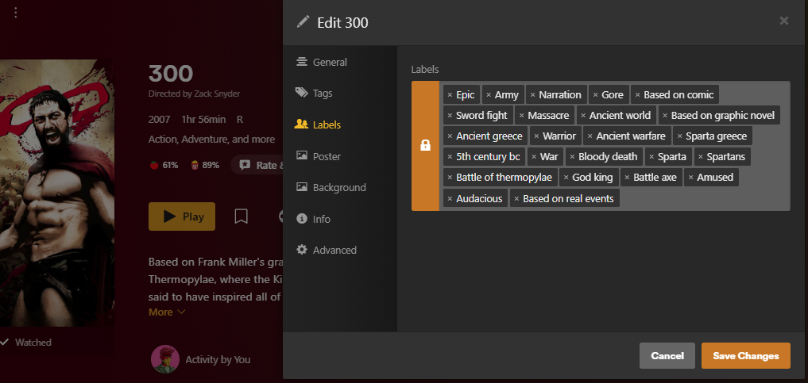
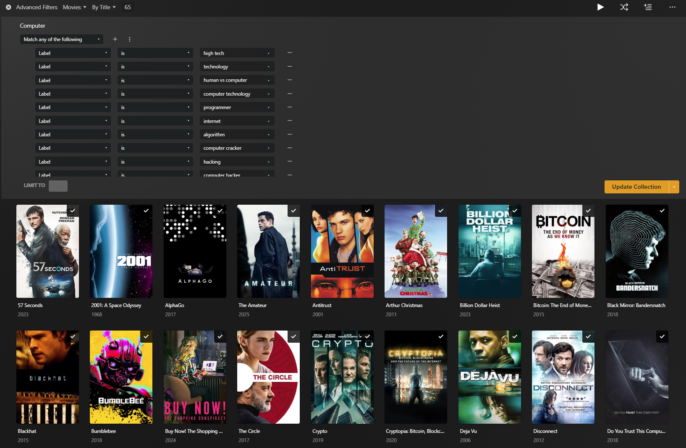
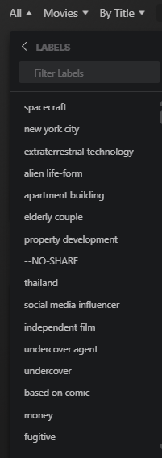
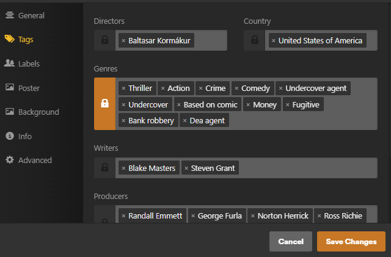

# Labelarr 🎬📺🏷️

[](https://github.com/nullable-eth/labelarr/releases/latest)
[](https://github.com/nullable-eth/labelarr/pkgs/container/labelarr)
[](https://golang.org/)
[](https://github.com/nullable-eth/labelarr/actions)

**Automatically sync TMDb keywords as Plex labels or genres for both movies and TV shows**  
A lightweight Go application that bridges your Plex media libraries with The Movie Database, adding relevant keywords as searchable labels or genres.

## What it does

Labelarr continuously monitors your Plex movie and TV show libraries and automatically:

- 🔍 Detects TMDb IDs from Plex metadata or file paths (e.g. `{tmdb-12345}`, `[tmdb:12345]`, `(tmdb;12345)`, etc.)
- 📥 Fetches movie and TV show keywords from TMDb API
- 🏷️ Adds keywords as Plex labels or genres (preserves existing values)
- 📊 Tracks processed media to avoid duplicates
- ⏰ Runs on a configurable timer (default: 5 minutes)

## ✅ Features

- ✅ **Non-destructive**: Never removes existing labels or genres
- ✅ **Smart detection**: Multiple TMDb ID sources (metadata and file paths)
- ✅ **Progress tracking**: Remembers processed movies to avoid re-processing
- ✅ **Lightweight**: ~10MB Alpine-based container
- ✅ **Secure**: Runs as non-root user
- ✅ **Auto-retry**: Handles API rate limits gracefully
- ✅ **Protocol flexibility**: Supports both HTTP and HTTPS Plex connections
- ✅ **Periodic Processing**: Automatically processes movies and TV shows on a configurable timer
- ✅ **Movie Support**: Full movie library processing with TMDb integration
- ✅ **TV Show Support**: Complete TV show library processing with TMDb integration
- ✅ **Smart Label/Genre Management**: Adds TMDb keywords as Plex labels or genres without removing existing values
- ✅ **Flexible TMDb ID Detection**: Extracts TMDb IDs from Plex metadata or file paths
- ✅ **Docker Ready**: Containerized for easy deployment
- ✅ **Environment Configuration**: Fully configurable via environment variables

### Examples

- Allows you to have TMDB keywords as labels in Plex:

  

- Create custom dynamic filters for multiple labels that will update automatically when new movies are labeled:

  

- Filter on the fly by a label:

  

## 🚀 Quick Start

```bash
docker run -d --name labelarr \
  -e PLEX_SERVER=localhost \
  -e PLEX_PORT=32400 \
  -e PLEX_REQUIRES_HTTPS=true \
  -e PLEX_TOKEN=your_plex_token_here \
  -e TMDB_READ_ACCESS_TOKEN=your_tmdb_read_access_token \
  -e PROCESS_TIMER=1h \
  -e MOVIE_PROCESS_ALL=true \
  -e TV_PROCESS_ALL=true \
  ghcr.io/nullable-eth/labelarr:latest
```

## 📋 Environment Variables

| Variable | Description | Default | Required | How to Get |
|----------|-------------|---------|----------|------------|
| `PLEX_SERVER` | Plex server IP/hostname | - | **Yes** | Your Plex server address |
| `PLEX_PORT` | Plex server port | - | **Yes** | Usually `32400` |
| `PLEX_REQUIRES_HTTPS` | Use HTTPS for Plex connection | `true` | No | `true`/`false` |
| `PLEX_TOKEN` | Plex authentication token | - | **Yes** | Plex Web App → F12 → Network tab → Look for `X-Plex-Token` in headers |
| `TMDB_READ_ACCESS_TOKEN` | TMDb API Bearer token | - | **Yes** | [TMDb API Settings](https://www.themoviedb.org/settings/api) |
| `PROCESS_TIMER` | Processing interval (e.g., `5m`, `1h`) | `1h` | No | `5m`, `10m`, `1h`, etc. |
| `MOVIE_LIBRARY_ID` | Specific movie library ID to process | - | No | See Finding Library IDs below |
| `TV_LIBRARY_ID` | Specific TV library ID to process | - | No | See Finding Library IDs below |
| `MOVIE_PROCESS_ALL` | Process all movie libraries (set to `true` to enable) | `false` | No | `true`/`false` |
| `TV_PROCESS_ALL` | Process all TV libraries (set to `true` to enable) | `false` | No | `true`/`false` |
| `UPDATE_FIELD` | Field to update: `label` (default) or `genre` | `label` | No | `label` or `genre` |
| `REMOVE` | Remove keywords mode: `lock` or `unlock` (runs once and exits) | - | No | `lock`, `unlock`, or leave empty |

## 🔍 Finding Library IDs

To find your library's ID, open your Plex web app, click on the desired library, and look for `source=` in the URL:

- `https://app.plex.tv/desktop/#!/media/xxxx/com.plexapp.plugins.library?source=1`
- Here, the library ID is `1`

Alternatively, you can use the library processing options:

- Set `MOVIE_PROCESS_ALL=true` to process all movie libraries
- Set `TV_PROCESS_ALL=true` to process all TV libraries

## 📚 Library Selection Logic

**⚠️ IMPORTANT CHANGE**: Starting with this version, explicit library configuration is required. The application will **NOT** auto-select libraries by default.

### Movie Libraries

- **`MOVIE_LIBRARY_ID=1`**: Process only the specific movie library with ID 1
- **`MOVIE_PROCESS_ALL=true`**: Process all movie libraries found in Plex
- **Neither set**: Movies are **NOT** processed (no default selection)

### TV Libraries  

- **`TV_LIBRARY_ID=2`**: Process only the specific TV library with ID 2
- **`TV_PROCESS_ALL=true`**: Process all TV libraries found in Plex
- **Neither set**: TV shows are **NOT** processed

### Why This Changed

Previously, the application would auto-select the first movie library if no movie library ID was specified. With the addition of TV show support, users might want to process only TV shows without movies, or vice versa. The auto-selection behavior would force movie processing even when users only wanted TV shows processed.

## 🔄 Changes from Previous Version

This version includes significant enhancements while maintaining backward compatibility:

### ✨ New Features

- **📺 TV Show Support**: Complete TV show library processing with TMDb keyword integration
- **🎯 Explicit Library Selection**: Must specify which libraries to process (no more auto-selection)
- **🔇 Reduced Verbosity**: Much quieter processing output - only shows new items and errors
- **📊 Better Progress Tracking**: Enhanced summary reporting for both movies and TV shows

### 🔄 Behavioral Changes

- **No Default Library Selection**: Application requires explicit configuration of which libraries to process
- **Backward Compatible**: All existing environment variables work the same way
- **Silent Processing**: Items already processed or with existing keywords are handled silently
- **Enhanced Error Handling**: Better error reporting for API issues and processing failures

### 📋 Migration Guide

If you were relying on auto-selection of the first movie library, you now need to explicitly configure which libraries to process:

- `MOVIE_LIBRARY_ID=<your_movie_library_id>` for a specific movie library, or
- `MOVIE_PROCESS_ALL=true` to process all movie libraries
- `TV_LIBRARY_ID=<your_tv_library_id>` for a specific TV library, or  
- `TV_PROCESS_ALL=true` to process all TV libraries

**Example using the "process all" approach:**

```bash
# Old (auto-selected first movie library)
docker run -d --name labelarr \
  -e PLEX_SERVER=localhost \
  -e PLEX_TOKEN=... \
  docker.io/nullableeth/labelarr:latest

# New (explicit library selection required)
docker run -d --name labelarr \
  -e PLEX_SERVER=localhost \
  -e PLEX_TOKEN=... \
  -e MOVIE_PROCESS_ALL=true \
  -e TV_PROCESS_ALL=true \
  ghcr.io/nullable-eth/labelarr:latest
```

Without explicit library configuration, the application will fetch all libraries but process none, essentially doing nothing.

## 🆕 UPDATE_FIELD: Sync as Labels or Genres

You can control whether TMDb keywords are synced as Plex **labels** (default) or **genres** by setting the `UPDATE_FIELD` environment variable:

- `UPDATE_FIELD=label` (default): Syncs keywords as Plex labels (original behavior)
- `UPDATE_FIELD=genre`: Syncs keywords as Plex genres

The chosen field will be **locked** after update to prevent Plex from overwriting it.

### Example Usage

```bash
docker run -d --name labelarr \
  -e PLEX_SERVER=localhost \
  -e PLEX_PORT=32400 \
  -e PLEX_TOKEN=your_plex_token_here \
  -e TMDB_READ_ACCESS_TOKEN=your_tmdb_read_access_token \
  -e MOVIE_PROCESS_ALL=true \
  -e TV_PROCESS_ALL=true \
  -e UPDATE_FIELD=genre \
  ghcr.io/nullable-eth/labelarr:latest
```

#### Example: Genres Updated and Locked in Plex



*Genres updated and locked by Labelarr using `UPDATE_FIELD=genre`. The lock icon indicates the field is protected from automatic changes by Plex.*

## 🗑️ REMOVE: Clean Up TMDb Keywords

The `REMOVE` environment variable allows you to remove **only** TMDb keywords from the selected field while preserving all other values (like custom labels for sharing). When `REMOVE` is set, the tool runs once and exits.

### Remove Options

- `REMOVE=lock`: Removes TMDb keywords and **locks** the field to prevent Plex from updating it
- `REMOVE=unlock`: Removes TMDb keywords and **unlocks** the field so metadata refresh can set new values

### When to Use Each Option

**Use `REMOVE=lock`:**

- When you want to permanently remove TMDb keywords but keep custom labels/genres
- For users who use labels for sharing or other purposes and don't want Plex to overwrite them
- When you want manual control over the field content

**Use `REMOVE=unlock`:**

- When you want to clean up and let Plex refresh metadata naturally
- To reset the field to Plex's default metadata values
- When switching from TMDb keywords back to standard Plex metadata

### Example Usage

#### Remove TMDb keywords from labels and lock the field

```bash
docker run --rm \
  -e PLEX_SERVER=localhost \
  -e PLEX_PORT=32400 \
  -e PLEX_TOKEN=your_plex_token_here \
  -e TMDB_READ_ACCESS_TOKEN=your_tmdb_read_access_token \
  -e UPDATE_FIELD=label \
  -e MOVIE_PROCESS_ALL=true \
  -e TV_PROCESS_ALL=true \
  -e REMOVE=lock \
  ghcr.io/nullable-eth/labelarr:latest
```

#### Remove TMDb keywords from genres and unlock for metadata refresh

```bash
docker run --rm \
  -e PLEX_SERVER=localhost \
  -e PLEX_PORT=32400 \
  -e PLEX_TOKEN=your_plex_token_here \
  -e TMDB_READ_ACCESS_TOKEN=your_tmdb_read_access_token \
  -e UPDATE_FIELD=genre \
  -e MOVIE_PROCESS_ALL=true \
  -e TV_PROCESS_ALL=true \
  -e REMOVE=unlock \
  ghcr.io/nullable-eth/labelarr:latest
```

**Note:** The `--rm` flag automatically removes the container after completion since this is a one-time operation.

## 🔒 Understanding Field Locking & Plex Metadata

Field locking is a crucial concept in Plex that determines whether Plex can automatically update metadata fields during library scans and metadata refreshes. Understanding how this works with Labelarr is essential for managing your media library effectively.

### 🔐 What is Field Locking?

When a field is **locked** in Plex:

- ✅ The field value is **protected** from automatic changes
- ✅ Plex **cannot** overwrite the field during metadata refresh
- ✅ Manual edits in Plex UI are still possible
- ✅ External tools (like Labelarr) can still modify the field
- 🔒 A **lock icon** appears next to the field in Plex UI

When a field is **unlocked** in Plex:

- 🔄 Plex **can** update the field during metadata refresh
- 🔄 New metadata agents can overwrite existing values
- 🔄 "Refresh Metadata" will update the field with fresh data
- 🔓 **No lock icon** appears in Plex UI

### 🎯 Labelarr's Field Locking Behavior

#### **During Normal Operation (Adding Keywords)**

Labelarr **always locks** the field after adding TMDb keywords to prevent Plex from accidentally removing them during future metadata refreshes.

#### **During Remove Operation**

- `REMOVE=lock`: Removes TMDb keywords but **keeps the field locked**
- `REMOVE=unlock`: Removes TMDb keywords and **unlocks the field**

### 📋 Practical Examples

#### **Scenario 1: Mixed Content Management**

You have movies with:

- 🏷️ TMDb keywords: `action`, `thriller`, `heist`  
- 🏷️ Custom labels: `watched`, `favorites`, `4k-remaster`

**Using `REMOVE=lock`:**

- ✅ Removes only: `action`, `thriller`, `heist`
- ✅ Keeps: `watched`, `favorites`, `4k-remaster`
- 🔒 Field remains **locked** - Plex won't add new genres
- 💡 **Best for**: Users who manually manage labels alongside TMDb keywords

**Using `REMOVE=unlock`:**

- ✅ Removes only: `action`, `thriller`, `heist`  
- ✅ Keeps: `watched`, `favorites`, `4k-remaster`
- 🔓 Field becomes **unlocked** - Plex can add new metadata
- 💡 **Best for**: Users who want Plex to manage metadata going forward

#### **Scenario 2: Complete Reset**

You want to completely reset your library's metadata:

1. **Step 1**: `REMOVE=unlock` - Removes TMDb keywords and unlocks fields
2. **Step 2**: Use Plex's "Refresh All Metadata" to restore original metadata
3. **Result**: Clean slate with Plex's default metadata

### 🛡️ Best Practices

#### **Use Locking When:**

- ✅ You manually curate labels/genres
- ✅ You use labels for organization (playlists, collections, etc.)
- ✅ You want to prevent accidental metadata overwrites
- ✅ You share your library and need consistent metadata

#### **Use Unlocking When:**

- ✅ You want to return to Plex's default metadata behavior
- ✅ You're switching to a different metadata agent
- ✅ You want Plex to automatically update metadata in the future
- ✅ You're troubleshooting metadata issues

### 🔍 Visual Indicators

In Plex Web UI, you'll see:

- 🔒 **Lock icon** = Field is locked (protected from automatic updates)
- 🔓 **No lock icon** = Field is unlocked (can be updated by Plex)


*The lock icon indicates this genre field is protected from automatic changes*

## 🔑 Getting API Keys

### Plex Token

1. Open Plex Web App in browser
2. Press F12 → Network tab
3. Refresh the page
4. Find any request with `X-Plex-Token` in headers
5. Copy the token value

### TMDb API Key

1. Visit [TMDb API Settings](https://www.themoviedb.org/settings/api)
2. Create account and generate API key
3. Use the Read Access Token (not the API key)

## 🐳 Docker Deployment

### Quick Start

```bash
docker run -d --name labelarr \
  -e PLEX_SERVER=localhost \
  -e PLEX_PORT=32400 \
  -e PLEX_REQUIRES_HTTPS=true \
  -e PLEX_TOKEN=your_plex_token_here \
  -e TMDB_READ_ACCESS_TOKEN=your_tmdb_read_access_token \
  -e MOVIE_PROCESS_ALL=true \
  -e TV_PROCESS_ALL=true \
  -e PROCESS_TIMER=1h \
  ghcr.io/nullable-eth/labelarr:latest
```

### Images Available

The application is automatically published to GitHub Container Registry (GHCR) with multiple tags:

- `ghcr.io/nullable-eth/labelarr:latest` - Latest stable release
- `ghcr.io/nullable-eth/labelarr:v1.0.x` - Specific version releases
- `ghcr.io/nullable-eth/labelarr:1.0.x` - Auto-incrementing versions from main branch

### 🤖 Automated Publishing

This project uses GitHub Actions to automatically build and publish Docker images:

#### **Automatic Releases**

- 🔄 **Auto-versioning**: Semantic versioning based on commit messages
  - `feat:` or `feature:` → Minor version bump (v1.1.0)
  - `BREAKING CHANGE` or `!:` → Major version bump (v2.0.0)
  - Other commits → Patch version bump (v1.0.1)
- 📦 **Multi-architecture**: Builds for `linux/amd64` and `linux/arm64`
- 🏷️ **Smart tagging**: Creates multiple tags including `latest`, version-specific, and date-based tags
- 📋 **Release notes**: Automatically generates changelog from commits

#### **Image Information**

All published images include:

- ✅ Security scanning via GitHub's built-in tools
- ✅ Multi-platform support (AMD64 + ARM64)
- ✅ Minimal Alpine Linux base (~10MB)
- ✅ Non-root user execution
- ✅ Build caching for faster builds

### Docker Compose

1. Download the `docker-compose.yml` file from this repository
2. Update environment variables with your credentials:

```yaml
version: '3.8'

services:
  labelarr:
    image: ghcr.io/nullable-eth/labelarr:latest
    container_name: labelarr
    restart: unless-stopped
    environment:
      - PLEX_SERVER=localhost
      - PLEX_PORT=32400
      - PLEX_REQUIRES_HTTPS=true
      - PLEX_TOKEN=your_plex_token_here
      - TMDB_READ_ACCESS_TOKEN=your_tmdb_read_access_token
      - MOVIE_PROCESS_ALL=true
      - TV_PROCESS_ALL=true
      - PROCESS_TIMER=1h
```

3. Run: `docker-compose up -d`

## 🐳 Docker Compose: Ensuring Labelarr Waits for Plex

To avoid Labelarr startup errors when Plex is not yet ready, use Docker Compose's `depends_on` with `condition: service_healthy` and add a healthcheck to your Plex service. This ensures Labelarr only starts after Plex is healthy.

Example:

```yaml
services:
  plex:
    image: plexinc/pms-docker:latest
    container_name: plex
    # ... other config ...
    healthcheck:
      test: curl --connect-timeout 15 --silent --show-error --fail http://localhost:32400/identity
      interval: 1m00s
      timeout: 15s
      retries: 3
      start_period: 1m00s
  labelarr:
    image: ghcr.io/nullable-eth/labelarr:latest
    container_name: labelarr
    depends_on:
      plex:
        condition: service_healthy
    # ... other config ...
```

This setup prevents Labelarr from logging connection errors if Plex is still starting up.

## 🛠️ Local Development

### Prerequisites

- Go 1.23+
- Git

### Build and Run

```bash
# Clone the repository
git clone https://github.com/nullable-eth/labelarr.git
cd labelarr

# Initialize Go modules
go mod tidy

# Set environment variables
export PLEX_SERVER=localhost
export PLEX_PORT=32400
export PLEX_TOKEN=your_plex_token
export TMDB_READ_ACCESS_TOKEN=your_tmdb_read_access_token
export MOVIE_PROCESS_ALL=true
export TV_PROCESS_ALL=true

# Run the application
go run main.go
```

### Build Binary

```bash
# Build for current platform
go build -o labelarr main.go

# Build for Linux (Docker)
CGO_ENABLED=0 GOOS=linux go build -a -installsuffix cgo -o labelarr main.go
```

## 📖 How It Works

1. **Movie Processing**: Iterates through all movies in the library
2. **TMDb ID Extraction**: Gets TMDb IDs from:
   - Plex metadata Guid field
   - File/folder names with `{tmdb-12345}` format
3. **Keyword Fetching**: Retrieves keywords from TMDb API
4. **Label Synchronization**: Adds new keywords as labels (preserves existing labels)
5. **Progress Tracking**: Remembers processed movies to avoid re-processing

## 🔍 TMDb ID Detection

The application can find TMDb IDs from multiple sources and supports flexible formats:

- **Plex Metadata**: Standard TMDb agent IDs
- **File Paths**: `{tmdb-12345}` in filenames or directory names
- **Flexible Formats**: The TMDb ID can be detected in a variety of patterns, not just `{tmdb-12345}`. Supported patterns include:
  - `{tmdb-12345}` (curly braces, anywhere in the folder or file name)
  - `[tmdb-12345]` (square brackets)
  - `(tmdb-12345)` (parentheses)
  - `tmdb-12345` (standalone, with or without delimiters)
  - Case-insensitive: `TMDB-12345`, `Tmdb-12345`, etc.
  - The TMDb ID can appear in either the directory or file name, and can be surrounded by spaces or other characters.
  - **Delimiters**: The TMDb ID pattern supports all common delimiters (such as `:`, `;`, `-`, `_`, etc.) between `tmdb` and the ID. For example:
    - `tmdb:15448`
    - `tmdb;15448`
    - `tmdb-15448`
    - `tmdb_15448`
    - `tmdb: 15448`, `tmdb- 15448`, etc.
    - These can appear in any of the supported bracket/brace/parenthesis formats or standalone.
    - The pattern will **not** match `tmdb15448` (no separator).

Example file paths:

```
/movies/The Matrix (1999) [tmdb-603]/The Matrix.mkv
/movies/Inception (2010) (tmdb:27205)/Inception.mkv
/movies/Avatar (2009) tmdb;19995/Avatar.mkv
/movies/Interstellar (2014) TMDB_157336/Interstellar.mkv
/movies/Edge Case - {tmdb-12345}/file.mkv
/movies/Colon: [tmdb:54321]/file.mkv
/movies/Semicolon; (tmdb;67890)/file.mkv
/movies/Underscore_tmdb_11111/file.mkv
/movies/ExtraSuffix tmdb-22222_extra/file.mkv
```

## 📊 Monitoring

### View Logs

```bash
# Docker logs
docker logs labelarr

# Follow logs
docker logs -f labelarr
```

### Log Output Includes

- Processing progress with movie counts
- TMDb ID detection results
- Label synchronization status
- API error handling and retries
- Detailed processing summaries

## 🔧 Troubleshooting

### Common Issues

**401 Unauthorized from Plex**

- Verify your Plex token is correct
- Check if your Plex server requires HTTPS

**401 Unauthorized from TMDb**

- Ensure you're using a valid API token.

**No TMDb ID found**

- Check if your movies have TMDb metadata
- Verify file naming includes `{tmdb-12345}` format
- Ensure TMDb agent is used in Plex

**Connection refused**

- Check PLEX_SERVER and PLEX_PORT values
- Try setting PLEX_REQUIRES_HTTPS=false for local servers

### 🎬 Radarr Users: Ensuring TMDb ID in File Paths

If you're using Radarr to manage your movie collection, follow these steps to ensure Labelarr can detect TMDb IDs from your file paths:

#### **Configure Radarr Naming to Include TMDb ID**

Radarr can automatically include TMDb IDs in your movie file and folder names. Update your naming scheme in Radarr settings:

**Recommended Settings:**

1. **Movie Folder Format**:

   ```
   {Movie CleanTitle} ({Release Year}) {tmdb-{TmdbId}}
   ```

   *Example*: `The Matrix (1999) {tmdb-603}`

2. **Movie File Format**:

   ```
   {Movie CleanTitle} ({Release Year}) {tmdb-{TmdbId}} - {[Quality Full]}{[MediaInfo VideoDynamicRangeType]}{[Mediainfo AudioCodec}{ Mediainfo AudioChannels]}{[MediaInfo VideoCodec]}{-Release Group}
   ```

   *Example*: `The Matrix (1999) {tmdb-603} - [Bluray-1080p][x264][DTS 5.1]-GROUP`

#### **Alternative Radarr Naming Options**

If you prefer different bracket styles, these formats also work with Labelarr:

- **Square brackets**: `{Movie CleanTitle} ({Release Year}) [tmdb-{TmdbId}]`
- **Parentheses**: `{Movie CleanTitle} ({Release Year}) (tmdb-{TmdbId})`
- **Different delimiters**: `{Movie CleanTitle} ({Release Year}) {tmdb:{TmdbId}}` or `{Movie CleanTitle} ({Release Year}) {tmdb;{TmdbId}}`

#### **Common Radarr Configuration Pitfalls**

❌ **Avoid these common mistakes:**

1. **Missing TMDb ID in paths**: Default Radarr naming like `{Movie CleanTitle} ({Release Year})` doesn't include TMDb IDs
2. **Using only IMDb IDs**: `{imdb-{ImdbId}}` won't work - Labelarr specifically needs TMDb IDs
3. **Folder vs. file naming**: Ensure TMDb ID is in at least one location (folder name OR file name)

#### **Verifying Your Configuration**

After updating Radarr naming:

1. **For new movies**: TMDb IDs will be included automatically
2. **For existing movies**: Use Radarr's "Rename Files" feature:
   - Go to Movies → Select movies → Mass Editor
   - Choose your root folder and click "Yes, move files"
   - This will rename existing files to match your new naming scheme

#### **Plex Agent Compatibility**

- **New Plex Movie Agent**: Works with any naming scheme above
- **Legacy Plex Movie Agent**: May require specific TMDb ID placement for optimal matching
- **Best practice**: Include TMDb ID in folder names for maximum compatibility

#### **Example Directory Structure**

```
/movies/
├── The Matrix (1999) {tmdb-603}/
│   └── The Matrix (1999) {tmdb-603} - [Bluray-1080p].mkv
├── Inception (2010) [tmdb-27205]/
│   └── Inception (2010) [tmdb-27205] - [WEBDL-1080p].mkv
└── Avatar (2009) (tmdb:19995)/
    └── Avatar (2009) (tmdb:19995) - [Bluray-2160p].mkv
```

#### **Migration from Existing Libraries**

If you have an existing movie library without TMDb IDs in file paths:

1. **Update Radarr naming scheme** as shown above
2. **Use Radarr's mass rename feature** to update existing files
3. **Wait for Plex to detect the changes** (or manually scan library)
4. **Run Labelarr** - it will now detect TMDb IDs from the updated file paths

**⚠️ Note**: Large libraries may take time to rename. Consider doing this in batches during low-usage periods.

## 🤝 Contributing

1. Fork the repository
2. Create a feature branch (`git checkout -b feature/amazing-feature`)
3. Commit your changes (`git commit -m 'Add amazing feature'`)
4. Push to the branch (`git push origin feature/amazing-feature`)
5. Open a Pull Request

## 📞 Support

- **GitHub**: [https://github.com/nullable-eth/labelarr](https://github.com/nullable-eth/labelarr)
- **Issues**: Report bugs and feature requests
- **Logs**: Check container logs for troubleshooting with `docker logs labelarr`

## 📄 License

This project is licensed under the MIT License - see the [LICENSE](LICENSE) file for details.

---

**Tags**: plex, tmdb, automation, movies, tv shows, labels, genres, docker, go, selfhosted, media management

---

⭐ **If you find this project helpful, please consider giving it a star!**
